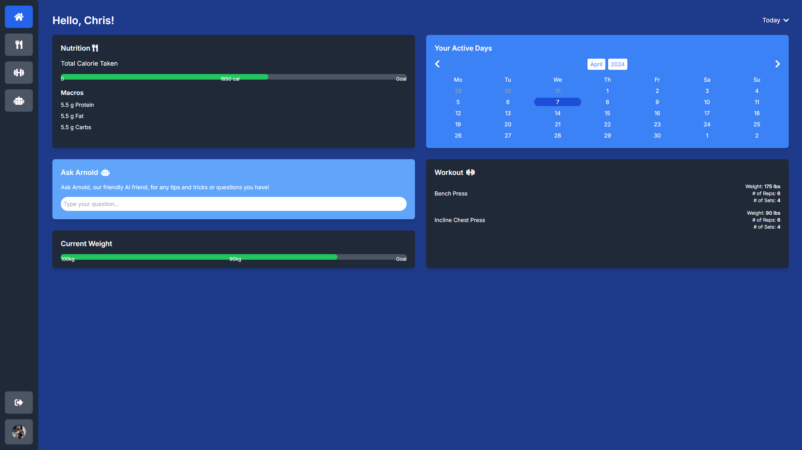
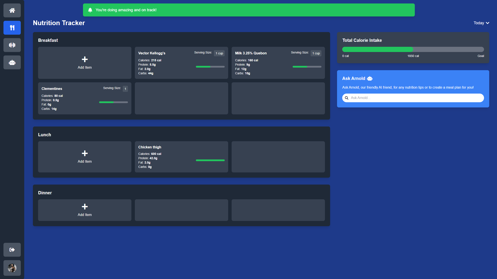
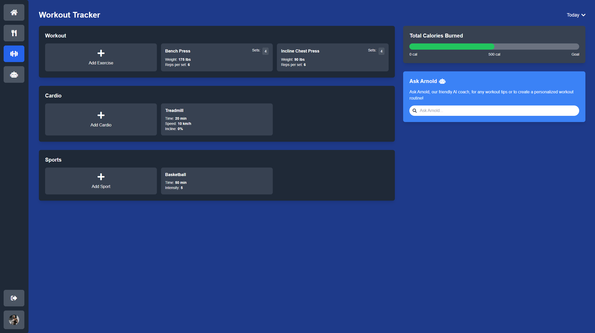
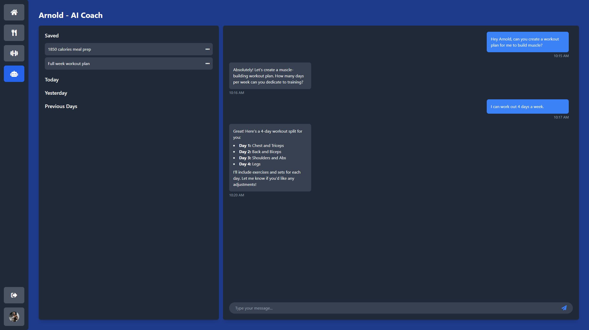

# SOEN357-Project
## Running the Project
There are two primary ways to run this project:

#### 1. Serving via a Local HTTP Server:
If you have Python installed, you can quickly start a local server.

Open Terminal or Command Prompt

Navigate to the Project Directory.

**Start the HTTP Server:**

`python -m http.server 8000`

This command starts a local server on port 8000. You can choose a different port if 8000 is in use.

Open your web browser and navigate to http://localhost:8000.

#### 2. Using Live Server Extension (VSCode):
If you're using VSCode, use the Live Server extension to launch a local server.
If not already installed, install the extension.
Right-click on the index.html file (or any other HTML file) in the Explorer panel.
Select Open with Live Server.

## Screenshots

